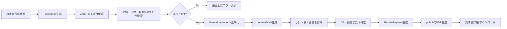
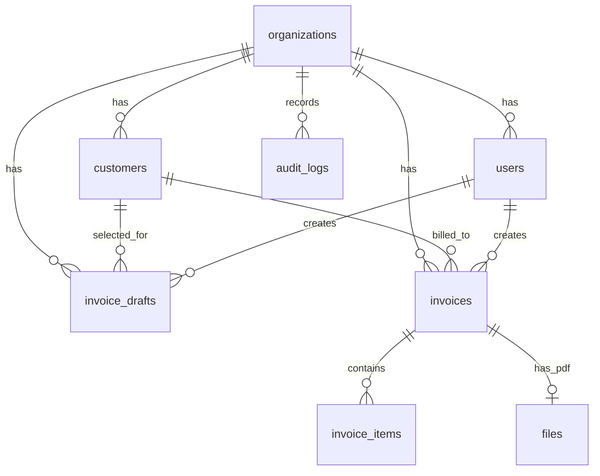
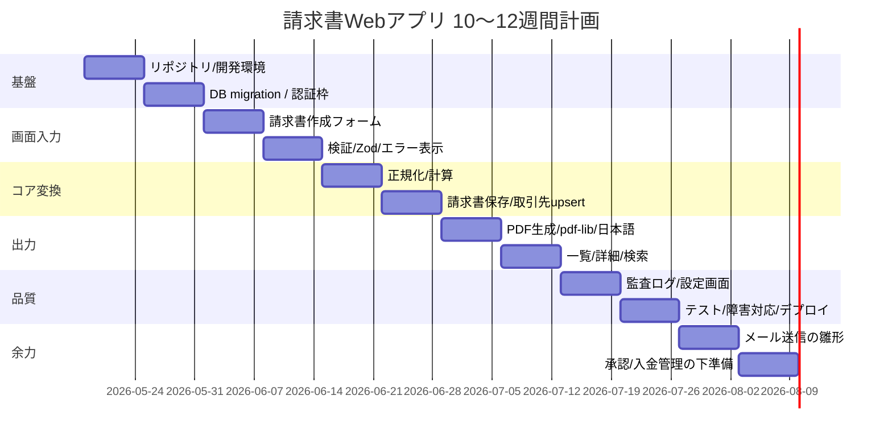

# データ指向プログラミングによる請求書Webアプリ実装計画

## エグゼクティブサマリー

本計画は、既存の請求書作成プロジェクトを、**データ指向プログラミングの考え方を保ったまま Web アプリ化**するための要件定義と実装計画である。前提は、**入力は CSV ファイルではなく画面入力のみ**、コア実装は **TypeScript / Node.js / Zod / pdf-lib** を継続利用し、永続化基盤は **PostgreSQL を第一候補**とする。

設計の中心は「画面」ではなく、**画面入力 → 検証 → 正規化 → 変換 → PDF → 保存**というデータの流れに置く。既存 CLI 実装で培った「入力・検証・変換・出力を分離する」強みは保ちつつ、入力源だけを CSV からフォームデータに置き換える。

MVP の結論は次のとおりである。

| 優先度 | 機能 | 内容 | 採否 |
|---|---|---|---|
| P0 | 画面入力 | 請求書ヘッダ、取引先、明細行をフォームで入力 | 必須 |
| P0 | 検証 | Zod による項目検証、明細間検証、エラー表示 | 必須 |
| P0 | 変換 | 画面入力を `InvoiceDraft` に正規化し、金額/税計算を行う | 必須 |
| P0 | PDF | pdf-lib で日本語 PDF 出力、再ダウンロード | 必須 |
| P0 | 保存 | PostgreSQL に請求書・明細・入力スナップショットを保存 | 必須 |
| P0 | 検索 | 請求書一覧、取引先・日付・状態による検索 | 必須 |
| P0 | 取引先管理 | 取引先マスタの作成、更新、選択入力 | 必須 |
| P0 | 監査 | だれが、いつ、何を作成・更新・確定したかの記録 | 必須 |
| P1 | 設定 | 自社情報、ロゴ、採番ルール、PDF テンプレート設定 | 推奨 |
| P1 | 再生成 | PDF 再生成、保存済み入力からの再編集 | 推奨 |
| P2 | メール送信 | 請求書送信、送信履歴 | 後続 |
| P2 | 承認 | 下書き→承認→確定 | 後続 |
| P2 | 入金管理 | 支払予定・消込・状態遷移 | 後続 |
| P2 | 外部連携 | Webhook / API / 会計連携 | 後続 |

MVP では、**単一請求書を画面で作成し、明細行を画面上で追加・削除・編集する方式**を採用する。複数明細はフォーム内の `items[]` として保持し、サーバ側で `InvoiceDraft` に正規化する。CSV の列・ヘッダ・文字コード・再アップロードといった論点は MVP から外す。

PostgreSQL を優先する理由は、**請求書・明細・取引先のような構造化データを正規化テーブルで管理しつつ、入力スナップショット・検証結果・PDF レンダリング用データを JSONB で保持できる**ためである。画面入力であっても、保存前後の中間データを残すことで、データ指向の追跡可能性を確保する。

## 前提整理

| オープン制約 | 現時点の扱い | 影響 |
|---|---|---|
| 認証方式 | MVP ではローカルアカウント前提で設計し、SSO へ拡張可能にする | `users` テーブル設計、セッション管理 |
| 想定ユーザー規模 | MVP は 1組織・1〜20名程度を仮定 | 性能要件、権限制御、運用設計 |
| デプロイ環境 | Docker でローカル開発、商用は Node 実行環境＋マネージド PostgreSQL を仮定 | ファイル保存方式、バックアップ方式 |
| 法令準拠レベル | 研究用途か業務運用か未指定 | 電帳法対応レベル、監査証跡、保存要件 |
| メール送信要否 | MVP では後続扱い | 配信ドメイン、送達性、監査の設計 |

## 機能要件

### 役割

| ロール | 主な権限 | MVP |
|---|---|---|
| 管理者 | ユーザー管理、設定変更、請求書作成、確定、PDF再生成、監査閲覧 | 対応 |
| 経理担当 | 請求書作成、検証結果確認、確定、PDF生成/閲覧、取引先管理 | 対応 |
| 閲覧者 | 一覧検索、詳細閲覧、PDFダウンロード | 対応 |
| 承認者 | 承認/差戻し | 将来拡張 |

MVP では、**承認者専用の独立ロールは持たず**、`admin` と `accountant` を中心に実装する。承認フロー追加時は `approver` ロールと `invoice_approvals` テーブルを追加する。

### 画面要件

| 画面 | 主な利用者 | 目的 | 完了条件 |
|---|---|---|---|
| ログイン | 全員 | 認証 | セッション確立後にダッシュボード遷移 |
| ダッシュボード | 管理者/経理 | 下書き件数、最近の請求書、未確定請求書を確認 | 主要導線へ1クリックで遷移 |
| 請求書作成 | 管理者/経理 | ヘッダ、取引先、明細、備考を入力 | 入力値を検証し、下書き保存または確定できる |
| 請求書編集 | 管理者/経理 | 下書き請求書の修正 | 再検証後に保存できる |
| 請求書確認 | 管理者/経理 | 計算結果、税額、PDFプレビューを確認 | エラー0件なら確定可能 |
| 請求書一覧 | 全員 | 検索、絞込、PDF再取得 | 条件検索とページングが可能 |
| 請求書詳細 | 全員 | 明細、計算結果、入力スナップショット、PDFを確認 | 画面で計算根拠が追える |
| 取引先一覧/詳細 | 管理者/経理 | 取引先の確認・編集 | 顧客情報が参照/更新できる |
| 設定 | 管理者 | 自社情報、ロゴ、採番ルール | PDF出力条件を変更できる |
| 監査ログ | 管理者 | 作成・更新・確定・再生成の証跡 | 操作履歴を検索できる |

### API 要件

| Method | Path | 用途 | MVP |
|---|---|---|---|
| POST | `/api/auth/login` | ログイン | 暫定対応 |
| POST | `/api/invoice-drafts` | 画面入力から下書き作成 | 対応 |
| GET | `/api/invoice-drafts/:id` | 下書き取得 | 対応 |
| PATCH | `/api/invoice-drafts/:id` | 下書き更新 | 対応 |
| POST | `/api/invoice-drafts/:id/validate` | 下書き検証、計算プレビュー | 対応 |
| POST | `/api/invoice-drafts/:id/commit` | 検証済み下書きを請求書として確定 | 対応 |
| GET | `/api/invoices` | 請求書一覧、検索 | 対応 |
| GET | `/api/invoices/:id` | 請求書詳細 | 対応 |
| POST | `/api/invoices/:id/pdf` | PDF生成/再生成 | 対応 |
| GET | `/api/invoices/:id/pdf` | PDFダウンロード | 対応 |
| GET | `/api/customers` | 取引先一覧 | 対応 |
| POST | `/api/customers` | 取引先作成 | 対応 |
| PATCH | `/api/customers/:id` | 取引先更新 | 対応 |
| GET | `/api/settings/company` | 自社設定取得 | 対応 |
| PUT | `/api/settings/company` | 自社設定更新 | 対応 |
| GET | `/api/audit-logs` | 監査ログ検索 | 対応 |
| POST | `/api/invoices/:id/send` | メール送信 | 後続 |
| POST | `/api/invoices/:id/approve` | 承認 | 後続 |
| POST | `/api/invoices/:id/payments` | 入金記録 | 後続 |

API は「画面用 DTO」をそのまま保存するのではなく、**ステージごとのデータ構造**を扱う。たとえば検証 API では、`formInput`、`normalizedInput`、`errors`、`calculationPreview` を分ける。これにより、画面入力に移行してもデータ指向の追跡可能性を失わない。

## 画面入力仕様

MVP では、請求書入力フォームを次の単位に分ける。

| 入力ブロック | 項目 | ルール |
|---|---|---|
| 請求書ヘッダ | `invoice_no`, `issue_date`, `due_date`, `currency` | `invoice_no` は空欄時に自動採番。`currency` は MVP では `JPY` 固定 |
| 取引先 | `customer_id` または `customer_code`, `customer_name`, `customer_email` | 既存取引先を選択、または新規入力から作成 |
| 明細 | `items[]` | 1件以上必須。画面上で追加・削除・並び替え可能 |
| 明細項目 | `line_no`, `item_code`, `item_name`, `quantity`, `unit`, `unit_price`, `tax_rate`, `notes` | `item_name`, `quantity`, `unit_price`, `tax_rate` は必須 |
| 備考 | `notes` | 0〜1000文字 |

### 入力項目定義

| 項目 | 必須 | 例 | ルール |
|---|---|---|---|
| `invoice_no` |  | `INV-202605-001` | 空欄時は自動採番 |
| `issue_date` | ○ | `2026-05-31` | `YYYY-MM-DD` |
| `due_date` | ○ | `2026-06-30` | `issue_date` 以降 |
| `customer_code` | ○ | `CUST-001` | 英数・`-`・`_`、組織内一意 |
| `customer_name` | ○ | `株式会社A` | 1〜200文字 |
| `customer_email` |  | `ap@example.co.jp` | メール形式 |
| `currency` | ○ | `JPY` | MVP は `JPY` 固定 |
| `items[].line_no` | ○ | `1` | 請求書内で一意。画面側で自動採番可 |
| `items[].item_code` |  | `SVC-001` | 任意 |
| `items[].item_name` | ○ | `サービス利用料` | 1〜200文字 |
| `items[].quantity` | ○ | `2` | `> 0` |
| `items[].unit` |  | `式` | 任意 |
| `items[].unit_price` | ○ | `5000` | `>= 0` |
| `items[].tax_rate` | ○ | `10` | `0 / 8 / 10` を初期許容 |
| `items[].notes` |  | `5月分` | 0〜500文字 |

### 画面入力検証ルール

| 種別 | ルール |
|---|---|
| 必須 | `issue_date`, `due_date`, `customer_code`, `customer_name`, `currency`, `items[].item_name`, `items[].quantity`, `items[].unit_price`, `items[].tax_rate` は必須 |
| 型 | 日付・整数・小数・メール形式は Zod で検証 |
| 範囲 | `quantity > 0`, `unit_price >= 0`, `tax_rate ∈ {0,8,10}` |
| 明細 | `items` は 1件以上必須。`line_no` は請求書内で重複禁止 |
| 整合性 | `due_date` は `issue_date` 以降 |
| マスタ整合 | 既存 `customer_code` がある場合、名称不一致は警告またはエラー |
| 採番 | `invoice_no` が空欄なら採番規則に従いサーバ側で生成 |
| 確定条件 | 1件でもエラーがあれば確定不可。下書き保存は可能にする |

### サンプル入力ペイロード

```json
{
  "invoiceNo": "INV-202605-001",
  "issueDate": "2026-05-31",
  "dueDate": "2026-06-30",
  "customer": {
    "code": "CUST-001",
    "name": "株式会社A",
    "email": "ap@a.example"
  },
  "currency": "JPY",
  "items": [
    {
      "lineNo": 1,
      "itemCode": "SVC-001",
      "itemName": "サービス利用料",
      "quantity": 2,
      "unit": "式",
      "unitPrice": 5000,
      "taxRate": 10,
      "notes": "5月分"
    },
    {
      "lineNo": 2,
      "itemCode": "OPS-001",
      "itemName": "保守費用",
      "quantity": 1,
      "unit": "式",
      "unitPrice": 3000,
      "taxRate": 10,
      "notes": "5月分"
    }
  ],
  "notes": "翌月末までにお支払いください"
}
```

## 計算ルール

MVP の請求金額計算は次で固定する。

- `line_amount = quantity × unit_price`
- `subtotal = Σ line_amount`
- `tax = 税率ごとの line_amount 合計 × tax_rate / 100` を四捨五入
- `total = subtotal + tax`

将来、端数処理を `floor / ceil / round` から設定できるように、自社設定に `tax_rounding_mode` を持つ。

## 業務ワークフロー



## データモデルと技術構成

### 技術スタック

| 層 | 採用 | 理由 |
|---|---|---|
| フロント | Next.js + TypeScript | 画面・API・SSR を単一リポジトリで管理しやすい |
| サーバ runtime | Node.js | 既存 CLI 実装資産を再利用しやすい |
| 検証 | Zod | 画面入力・API 入出力・設定値の実行時検証を統一できる |
| PDF | pdf-lib | 現行 PDF ロジックと日本語フォント埋め込み資産を継続利用できる |
| DB | PostgreSQL | 正規化テーブル + JSONB スナップショットが両立する |
| 保存 | ローカル FS（dev）/ オブジェクトストレージ（prod） | 生成PDFの保存に利用 |

推奨ステージは以下の 6 段階。

```text
FormInput
→ ValidatedInput
→ NormalizedInput
→ InvoiceDraft
→ InvoiceCalculated
→ RenderPayload
```

この構造にすると、Web アプリ化後も「入力」「検証」「変換」「出力」が分離され、変換ロジックを `packages/core` として共通化できる。

### 推奨リポジトリ構成

```text
apps/
  web/                 # Next.js UI + Route Handlers
packages/
  contracts/           # Zod schema / DTO / enum
  core/                # validate / normalize / transform / calculate
  pdf/                 # pdf-lib テンプレートと描画
  db/                  # SQL migration / query
  shared/              # 共通 utility
infra/
  docker/              # 開発環境
```

### エンティティ関係図



### 主要テーブル

| テーブル | 役割 | 主な列 |
|---|---|---|
| `organizations` | 企業単位設定 | `id, name, invoice_prefix, tax_rounding_mode, company_profile_jsonb` |
| `users` | 利用者 | `id, org_id, email, display_name, role, password_hash, is_active` |
| `customers` | 取引先マスタ | `id, org_id, customer_code, name, email, address, metadata` |
| `invoice_drafts` | 画面入力の下書き | `id, org_id, customer_id, created_by, status, form_input, validation_result, calculation_preview` |
| `invoices` | 請求書ヘッダ | `id, org_id, invoice_no, customer_id, issue_date, due_date, subtotal, tax_amount, total_amount, status, source_snapshot, transformed_snapshot, render_payload` |
| `invoice_items` | 請求書明細 | `id, invoice_id, line_no, item_code, item_name, quantity, unit_price, tax_rate, amount` |
| `files` | 生成PDF | `id, org_id, storage_key, filename, mime_type, sha256, size_bytes` |
| `audit_logs` | 監査証跡 | `id, org_id, actor_user_id, entity_type, entity_id, action, payload_jsonb` |

### JSONB の使いどころ

| JSONB列 | 格納内容 | 意図 |
|---|---|---|
| `invoice_drafts.form_input` | 画面から送信された入力値 | 下書き再編集と入力起源の保存 |
| `invoice_drafts.validation_result` | 検証結果、警告、エラー | UI 表示・監査 |
| `invoice_drafts.calculation_preview` | 確定前の計算結果 | 確認画面表示 |
| `invoices.source_snapshot` | 確定時の入力スナップショット | データ起源の保存 |
| `invoices.transformed_snapshot` | 計算後スナップショット | 金額根拠の保存 |
| `invoices.render_payload` | PDF 描画用データ | 再生成時の入力 |
| `audit_logs.payload_jsonb` | 差分や操作内容 | 監査 |

### SQL DDL 例

```sql
CREATE EXTENSION IF NOT EXISTS pgcrypto;

CREATE TABLE organizations (
  id UUID PRIMARY KEY DEFAULT gen_random_uuid(),
  name TEXT NOT NULL,
  invoice_prefix TEXT NOT NULL DEFAULT 'INV',
  tax_rounding_mode TEXT NOT NULL DEFAULT 'round'
    CHECK (tax_rounding_mode IN ('floor', 'ceil', 'round')),
  company_profile_jsonb JSONB NOT NULL DEFAULT '{}'::jsonb,
  created_at TIMESTAMPTZ NOT NULL DEFAULT NOW(),
  updated_at TIMESTAMPTZ NOT NULL DEFAULT NOW()
);

CREATE TABLE users (
  id UUID PRIMARY KEY DEFAULT gen_random_uuid(),
  org_id UUID NOT NULL REFERENCES organizations(id) ON DELETE CASCADE,
  email TEXT NOT NULL,
  display_name TEXT NOT NULL,
  role TEXT NOT NULL CHECK (role IN ('admin', 'accountant', 'viewer')),
  password_hash TEXT,
  is_active BOOLEAN NOT NULL DEFAULT TRUE,
  created_at TIMESTAMPTZ NOT NULL DEFAULT NOW(),
  UNIQUE (org_id, email)
);

CREATE TABLE customers (
  id UUID PRIMARY KEY DEFAULT gen_random_uuid(),
  org_id UUID NOT NULL REFERENCES organizations(id) ON DELETE CASCADE,
  customer_code TEXT NOT NULL,
  name TEXT NOT NULL,
  email TEXT,
  postal_code TEXT,
  address1 TEXT,
  address2 TEXT,
  metadata JSONB NOT NULL DEFAULT '{}'::jsonb,
  created_at TIMESTAMPTZ NOT NULL DEFAULT NOW(),
  updated_at TIMESTAMPTZ NOT NULL DEFAULT NOW(),
  UNIQUE (org_id, customer_code)
);

CREATE TABLE invoice_drafts (
  id UUID PRIMARY KEY DEFAULT gen_random_uuid(),
  org_id UUID NOT NULL REFERENCES organizations(id) ON DELETE CASCADE,
  customer_id UUID REFERENCES customers(id),
  created_by UUID NOT NULL REFERENCES users(id),
  status TEXT NOT NULL CHECK (
    status IN ('draft', 'validated', 'validation_failed', 'committed')
  ),
  form_input JSONB NOT NULL,
  validation_result JSONB NOT NULL DEFAULT '{}'::jsonb,
  calculation_preview JSONB NOT NULL DEFAULT '{}'::jsonb,
  created_at TIMESTAMPTZ NOT NULL DEFAULT NOW(),
  updated_at TIMESTAMPTZ NOT NULL DEFAULT NOW(),
  committed_at TIMESTAMPTZ
);

CREATE TABLE invoices (
  id UUID PRIMARY KEY DEFAULT gen_random_uuid(),
  org_id UUID NOT NULL REFERENCES organizations(id) ON DELETE CASCADE,
  draft_id UUID REFERENCES invoice_drafts(id),
  customer_id UUID NOT NULL REFERENCES customers(id),
  created_by UUID NOT NULL REFERENCES users(id),
  invoice_no TEXT NOT NULL,
  issue_date DATE NOT NULL,
  due_date DATE NOT NULL,
  currency CHAR(3) NOT NULL DEFAULT 'JPY',
  subtotal NUMERIC(14,2) NOT NULL,
  tax_amount NUMERIC(14,2) NOT NULL,
  total_amount NUMERIC(14,2) NOT NULL,
  status TEXT NOT NULL CHECK (
    status IN ('draft', 'finalized', 'pdf_generated', 'cancelled')
  ),
  source_snapshot JSONB NOT NULL,
  transformed_snapshot JSONB NOT NULL,
  render_payload JSONB NOT NULL,
  created_at TIMESTAMPTZ NOT NULL DEFAULT NOW(),
  updated_at TIMESTAMPTZ NOT NULL DEFAULT NOW(),
  UNIQUE (org_id, invoice_no)
);

CREATE TABLE invoice_items (
  id UUID PRIMARY KEY DEFAULT gen_random_uuid(),
  invoice_id UUID NOT NULL REFERENCES invoices(id) ON DELETE CASCADE,
  line_no INT NOT NULL,
  item_code TEXT,
  item_name TEXT NOT NULL,
  quantity NUMERIC(12,3) NOT NULL,
  unit TEXT,
  unit_price NUMERIC(14,2) NOT NULL,
  tax_rate NUMERIC(5,2) NOT NULL,
  amount NUMERIC(14,2) NOT NULL,
  metadata JSONB NOT NULL DEFAULT '{}'::jsonb,
  UNIQUE (invoice_id, line_no)
);

CREATE INDEX idx_invoice_drafts_form_input_gin
  ON invoice_drafts USING GIN (form_input jsonb_path_ops);

CREATE INDEX idx_invoices_render_payload_gin
  ON invoices USING GIN (render_payload jsonb_path_ops);

CREATE INDEX idx_invoices_customer_date
  ON invoices (customer_id, issue_date DESC);
```

## 非機能要件

| 区分 | 要件 |
|---|---|
| セキュリティ | HTTPS 前提。API 境界は Zod で検証。ローカル認証時は `argon2id` 相当の強ハッシュを利用。ロール単位の認可を必須化。監査ログは削除不可扱いにする |
| データ完全性 | 請求書確定時はトランザクションを用いる。`customers`, `invoice_drafts`, `invoices`, `invoice_items`, `audit_logs` は同一トランザクションで確定する |
| 可観測性 | `request_id` と `invoice_id` / `draft_id` をログに付与。エラーは画面向け整形とサーバログを分離する。重要イベントは `audit_logs` に永続化する |
| 性能 | 請求書フォーム検証は 1 秒以内、単票 PDF 生成は 3 秒以内、一覧検索 p95 は 1 秒以内を目標 |
| バックアップ | PostgreSQL は日次フルバックアップ + WAL/PITR 推奨。生成 PDF はバージョニング付きオブジェクト保存を推奨 |
| スケーラビリティ | MVP は 1組織 1〜20ユーザー想定。将来は API/worker 分離を可能にする。PDF生成は件数増大時に非同期ジョブ化できるよう境界を分ける |
| 運用 | SQL マイグレーションを採用し、起動時自動反映は避ける。`/healthz` と `readiness` を分ける。開発は Docker、商用はマネージド PostgreSQL を推奨 |
| 保守性 | 画面ロジックと変換ロジックを分離する。`packages/core` の純粋関数に単体テストを集中させ、フォーム入力フィクスチャによる回帰試験を設ける |
| 法対応準備 | 研究用途では完全準拠をゴールにしないが、将来対応のため `created_at`, `updated_at`, 操作履歴, 入力スナップショット, 生成PDF, 再生成可能なスナップショットを保持する |

MVP で特に重要なのは、**「法令そのもの」を実装することではなく、後から監査可能なデータ軌跡を残すこと**である。画面入力値・変換結果・出力結果を別段階として残しておけば、仕様変更や法対応が入っても追跡しやすい。

## 実装計画

### 2〜3か月のマイルストーン

| 期間 | 目標 | 主要成果物 | 完了条件 |
|---|---|---|---|
| 週1-2 | 基盤構築 | モノレポ、Next.js、PostgreSQL、SQL migration、最低限の認証枠 | ログイン後に空の画面が動く |
| 週3-4 | 請求書フォーム | 請求書作成画面、明細行 UI、取引先選択、Zod検証、エラー表示 | 画面入力で検証結果が出る |
| 週5-6 | 変換と保存 | 正規化、請求書集約、取引先 upsert、下書き/確定保存 | 画面入力から請求書一覧へ表示される |
| 週7-8 | PDF出力 | pdf-lib 統合、日本語フォント、詳細画面、PDF 再生成 | 確定済請求書から PDF が出る |
| 週9-10 | 検索と運用 | 一覧検索、設定画面、監査ログ、バックアップ方針、E2E試験 | 主要ユースケースが通る |
| 週11-12 | 余力対応 | メール送信の雛形、承認/入金管理のスキーマ下準備 | P1 対応または品質強化 |

### 推奨スプリント計画



### 実装順序の判断

この計画では、**まず画面入力の契約を正しく決めること**を最優先にする。

理由は、画面入力のデータ構造が曖昧なまま PDF や DB 保存を先に作ると、後からフォーム・検証・変換ロジックの境界が崩れるからである。

実装順は次で固定する。

1. **画面入力スキーマの確定**
2. **検証とエラー表示**
3. **請求書変換と DB 保存**
4. **PDF 生成**
5. **検索・設定・監査**
6. **周辺機能**

### 主要リスクと対策

| リスク | 内容 | 対策 |
|---|---|---|
| 入力項目の変動 | 項目追加・入力方式変更が途中で起きる | `contracts` にバージョン付き schema を置く |
| 認証方式の後出し変更 | SSO 指定が後から入る | `users` に `auth_provider` 拡張余地を残す |
| 画面状態の肥大化 | 明細行・取引先・計算結果が UI に密結合する | 画面状態は `FormInput`、変換は `packages/core` に分離する |
| 法対応の拡大 | 電帳法/監査要件が追加される | 入力スナップショット・変換後JSON・PDF・監査ログを分けて保存 |
| 画面先行の設計崩れ | 変換ロジックが UI に埋まる | `packages/core` を純粋関数に固定する |

### 最終方針

本プロジェクトの最適な初期像は、**「画面入力専用」「データ変換中心」「PostgreSQL に途中データも残す」請求書 Web アプリ**である。

MVP で本当に外せないのは **画面入力、検証、PDF 出力、検索性、証跡**であり、承認や入金管理は構造だけ先に用意して後から伸ばすのが妥当である。

そのため、最初のリリースは **画面入力→検証→変換→PDF→保存** を一貫して確実に動かすことに集中し、Webアプリ化によっても、既存プロジェクトのデータ指向性を崩さないことを最重要原則とする。
