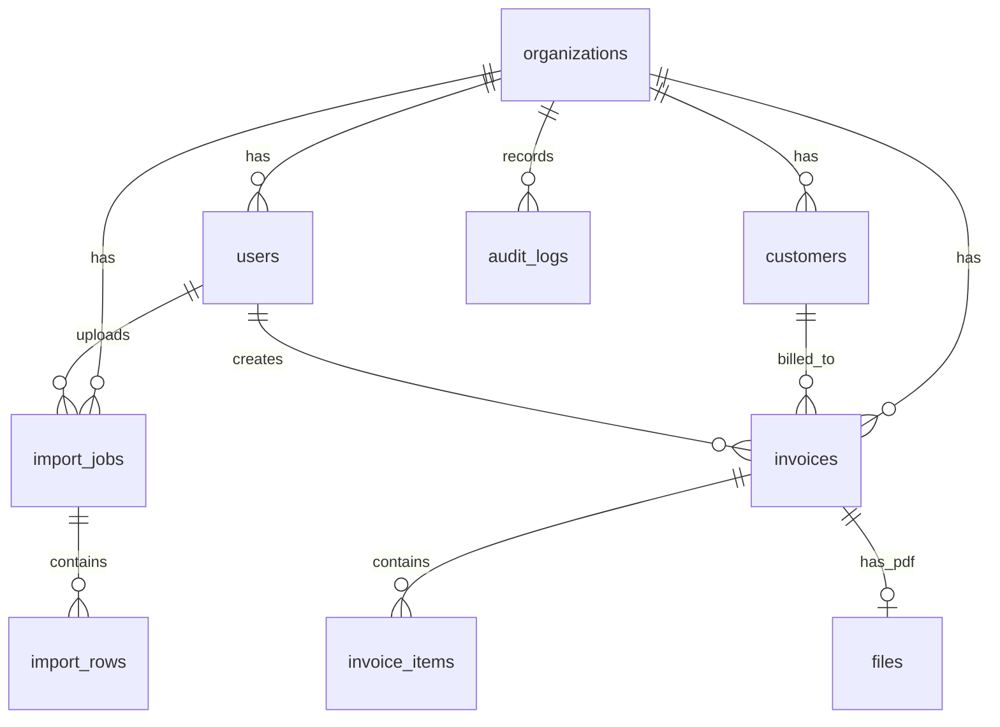
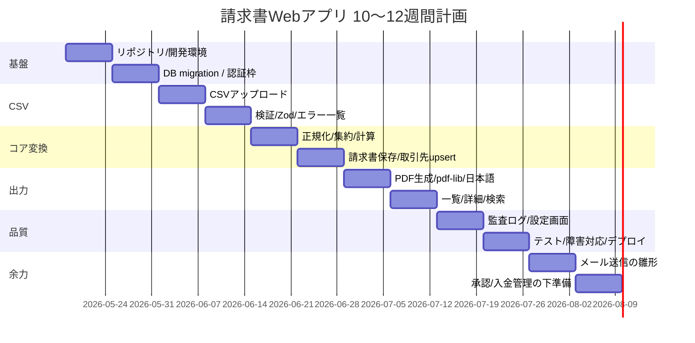

# データ指向プログラミングによる請求書Webアプリ実装計画

## エグゼクティブサマリー

本計画は、既存の請求書作成プロジェクトを、**データ指向プログラミングの考え方を保ったまま Web アプリ化**するための要件定義と実装計画である。前提は、**入力は CSV のみ**、コア実装は **TypeScript / Node.js / Zod / pdf-lib** を継続利用し、永続化基盤は **PostgreSQL を第一候補**とする。設計の中心は「画面」ではなく、**CSV → 検証 → 正規化 → 変換 → PDF → 保存**というデータの流れに置く。これは既存 CLI 実装の強みをそのまま Web に持ち込む方針である。

比較した主要な請求書 SaaS では、**CSV取込・PDF出力・メール送信はほぼ標準機能**であり、差別化要素は **承認フロー、入金消込、API 連携、既存フォーマット吸収**に寄っている。したがって、本プロジェクトの MVP は「CSV の厳密な受理」「請求書の正確な計算」「PDF 出力」「検索・再取得」に集中し、**メール送信・承認・入金管理は拡張機能として後ろに置く**のが妥当である。 citeturn26view0turn23view0turn24view0turn25view0

MVP の結論は次のとおりである。  
**P0（必須）** は、CSVアップロード、ヘッダ/行検証、エラー可視化、請求書変換、PDF生成、請求書一覧/詳細/検索、取引先マスタ、監査ログ。  
**P1（準必須）** は、ロゴ/自社情報設定、請求書番号採番ルール、再生成、インポート履歴。  
**P2（後続）** は、メール送信、承認フロー、入金管理、外部 API/Webhook、複雑な権限分離である。

MVP では、**単一 CSV ファイル・1明細1行方式**を採用する。複数明細の請求書は `source_invoice_key` で束ねる。これにより、CSV で表現しづらいネスト構造を回避しつつ、請求書単位への集約をサーバ側の純粋関数として整理できる。市場製品でも、サンプル CSV を配布して所定フォーマットで一括作成する方式が主流であり、MVP における「厳密フォーマット・再アップロード型」は十分に実用的である。 citeturn23view1turn24view2turn25view1turn26view2

PostgreSQL を優先する理由は、**請求書・明細・取引先のような構造化データを正規化テーブルで管理しつつ、入力スナップショット・検証結果・PDF レンダリング用データを JSONB で保持できる**ためである。`jsonb` は分解済みバイナリ形式で保持され、インデックスも利用できるため、データ指向の「途中データ」を残しながら検索性も確保しやすい。MySQL でも JSON は扱えるが、JSON 列のインデックスは生成列経由の設計が中心になる。SQLite は試作には向くが、Web アプリとしての同時利用・運用では PostgreSQL に劣る。SQL Server も候補だが、本テーマでは導入重量が相対的に大きい。 citeturn21view3turn21view1turn20view1turn20view2turn20view3

### MVP 優先順位

| 優先度 | 機能 | 内容 | 採否 |
|---|---|---|---|
| P0 | CSV取込 | CSVアップロード、文字コード/ヘッダ検証、行パース | 必須 |
| P0 | 検証 | Zod による項目検証、クロス行検証、エラー一覧 | 必須 |
| P0 | 変換 | `source_invoice_key` 単位で集約、金額/税計算 | 必須 |
| P0 | PDF | pdf-lib で日本語 PDF 出力、再ダウンロード | 必須 |
| P0 | 保存 | PostgreSQL に請求書・明細・インポート履歴を保存 | 必須 |
| P0 | 検索 | 請求書一覧、取引先・日付・状態による検索 | 必須 |
| P0 | 監査 | だれが、いつ、何を取り込んだかの記録 | 必須 |
| P1 | 設定 | 自社情報、ロゴ、採番ルール、PDF テンプレート設定 | 推奨 |
| P1 | 再生成 | PDF 再生成、インポート履歴から再実行 | 推奨 |
| P2 | メール送信 | 請求書送信、送信履歴 | 後続 |
| P2 | 承認 | 下書き→承認→確定 | 後続 |
| P2 | 入金管理 | 支払予定・消込・状態遷移 | 後続 |
| P2 | 外部連携 | Webhook / API / 会計連携 | 後続 |

## 前提整理と比較調査

本報告では、未確定事項を次の **オープン制約**として扱う。これらは機能定義を止める要因ではないが、実装方式に影響する。

| オープン制約 | 現時点の扱い | 影響 |
|---|---|---|
| 認証方式 | 未指定。MVP ではローカルアカウント前提で設計し、SSO へ拡張可能にする | `users` テーブル設計、セッション管理 |
| 想定ユーザー規模 | 未指定。MVP は 1組織・1〜20名程度を仮定 | 性能要件、権限制御、運用設計 |
| デプロイ環境 | 未指定。Docker でローカル開発、商用は Node 実行環境＋マネージド PostgreSQL を仮定 | ファイル保存方式、バックアップ方式 |
| 法令準拠レベル | 研究用途か業務運用か未指定 | 電帳法対応レベル、監査証跡、保存要件 |
| メール送信要否 | 未指定 | MVP 範囲の切り分け |

比較対象は、**freee請求書、マネーフォワード クラウド請求書、Misoca、MakeLeaps** とした。選定理由は、日本語での公式情報があり、CSV・PDF・送付・API・承認/入金管理の差が読み取りやすいためである。価格は 2026-05-17 時点の公開入口価格または代表的な下限料金で整理し、機能は公式ページで確認できる範囲に限定した。 citeturn16view0turn17view0turn26view0turn26view1turn26view2turn14view0turn14view1turn23view0turn23view1turn23view2turn17view1turn15view5turn24view0turn24view1turn24view2turn14view4turn25view0turn25view1turn25view2turn25view3turn25view4turn17view2

| サービス | 価格の入口 | CSV取込 | PDF出力 | メール送信 | API連携 | 承認/入金管理 | 本プロジェクトへの示唆 |
|---|---|---|---|---|---|---|---|
| freee請求書 | 無料〜。大量発行系はスタンダード年払 1,980円/月、アドバンス 10,000円/月、一括送信 4,750円/月〜 | ○ | ○ | ○ | ○ | 承認ワークフロー、入金消込自動化あり | 将来的に承認・消込まで伸ばせる構造にしておく価値が高い |
| マネーフォワード クラウド請求書 | 個人 900円/月〜、法人 2,480円/月〜 | ○ | ○ | ○ | ○ | 回収消込表・入金ステータス管理あり | 請求後の検索・一覧・回収状況は UI の基本項目に入れるべき |
| Misoca | 無料（月10通）〜、プラン15 年8,800円、プラン100 年33,500円 | ○ | ○ | ○ | 会計連携中心 | 請求/入金ステータス、売掛残高、回収予定一覧あり | 小規模向け UX を意識し、CSV→PDF までを最短導線にするべき |
| MakeLeaps | 1,300円/ユーザー/月 + 取引先数従量 | ○（Excel/CSV、カスタムCSV） | ○ | ○ | ○（REST API） | 段階承認、入金消込あり | 既存 CSV に合わせる拡張余地と、将来の承認機能の設計余白を持たせるべき |

比較から導く要点は明確である。  
第一に、**CSV取込・PDF出力・メール送信は土台機能**であり、MVP から外すべきではない。ただしメール送信は、業務価値は高いものの、配信ドメイン・送達性・監査の論点が増えるため、研究用初期実装では後ろに置いても妥当である。  
第二に、**承認・入金管理・API は差別化機能**であり、競合でも上位導入価値として扱われている。したがって、本計画では P2 に置きつつ、状態遷移・イベントログ・支払関連テーブルを追加できるようにデータモデルだけ先に整える。  
第三に、CSV は「自由入力」ではなく、**指定フォーマット + サンプル配布 + 厳格検証**で運用する方が現実的である。 citeturn26view0turn23view0turn24view0turn25view2

## 機能要件

### 役割

| ロール | 主な権限 | MVP |
|---|---|---|
| 管理者 | ユーザー管理、設定変更、CSV取込、確定、PDF再生成、監査閲覧 | 対応 |
| 経理担当 | CSV取込、検証結果確認、請求書確定、PDF生成/閲覧、取引先管理 | 対応 |
| 閲覧者 | 一覧検索、詳細閲覧、PDFダウンロード | 対応 |
| 承認者 | 承認/差戻し | 将来拡張 |

MVP では、**承認者専用の独立ロールは持たず**、`admin` と `accountant` を中心に実装する。承認フロー追加時は `approver` ロールと `invoice_approvals` テーブルを追加する。

### 画面要件

| 画面 | 主な利用者 | 目的 | 完了条件 |
|---|---|---|---|
| ログイン | 全員 | 認証 | セッション確立後にダッシュボード遷移 |
| ダッシュボード | 管理者/経理 | 今日の未処理件数、最近のインポート、最近の請求書 | 主要導線へ1クリックで遷移 |
| CSVインポート | 管理者/経理 | CSVアップロード、プレビュー生成 | ファイル選択後に検証開始できる |
| インポート結果 | 管理者/経理 | 行エラー確認、集約結果確認、確定 | エラー0件なら確定可能 |
| 請求書一覧 | 全員 | 検索、絞込、PDF再取得 | 条件検索とページングが可能 |
| 請求書詳細 | 全員 | 明細、計算結果、スナップショット、PDF | 画面で計算根拠が追える |
| 取引先一覧/詳細 | 管理者/経理 | 取引先の確認・編集 | 顧客情報が参照/更新できる |
| 設定 | 管理者 | 自社情報、ロゴ、採番ルール | PDF出力条件を変更できる |
| 監査ログ | 管理者 | 取込・確定・再生成の証跡 | 操作履歴を検索できる |

### API 要件

| Method | Path | 用途 | MVP |
|---|---|---|---|
| POST | `/api/auth/login` | ログイン | 暫定対応 |
| POST | `/api/imports` | CSVアップロード、インポートジョブ作成 | 対応 |
| GET | `/api/imports/:id` | ジョブ概要取得 | 対応 |
| GET | `/api/imports/:id/rows` | 行別検証結果取得 | 対応 |
| POST | `/api/imports/:id/commit` | 検証済みデータを請求書として確定 | 対応 |
| GET | `/api/invoices` | 請求書一覧、検索 | 対応 |
| GET | `/api/invoices/:id` | 請求書詳細 | 対応 |
| POST | `/api/invoices/:id/pdf` | PDF生成/再生成 | 対応 |
| GET | `/api/invoices/:id/pdf` | PDFダウンロード | 対応 |
| GET | `/api/customers` | 取引先一覧 | 対応 |
| POST | `/api/customers` | 取引先作成 | 対応 |
| PATCH | `/api/customers/:id` | 取引先更新 | 対応 |
| GET | `/api/settings/company` | 自社設定取得 | 対応 |
| PUT | `/api/settings/company` | 自社設定更新 | 対応 |
| GET | `/api/audit-logs` | 監査ログ検索 | 対応 |
| POST | `/api/invoices/:id/send` | メール送信 | 後続 |
| POST | `/api/invoices/:id/approve` | 承認 | 後続 |
| POST | `/api/invoices/:id/payments` | 入金記録 | 後続 |

**設計上の重要点**として、API は「画面用 DTO」を返すのではなく、**ステージごとのデータ構造**を返す。たとえばインポート結果では、`rawRow`、`normalizedRow`、`errors`、`groupPreview` を分ける。これによりデータ指向の追跡可能性を失わない。

### CSV 仕様

MVP では、**ヘッダ名は固定、列順は任意**とする。  
CSV パーサはヘッダ名でマッピングするため、ユーザーが列を並び替えても動作するが、**必須ヘッダが不足している場合はバッチ全体を失敗**とする。これは、主要 SaaS がサンプル CSV を配布し、指定フォーマットで一括作成する方式に近い。特にマネーフォワードは「請求書行」と「品目行」を含む縦型フォーマットを採っており、Misoca・freee・MakeLeaps も指定サンプルを前提にしているため、本プロジェクトも「自由 CSV」ではなく「契約済み CSV」を採るのが現実的である。 citeturn23view1turn24view2turn25view1turn26view2

**文字コード・形式**
- 文字コード: UTF-8（BOM許容）
- 区切り: `,`
- 改行: LF / CRLF
- 1ファイル最大目安: 10,000 行 / 5MB
- 通貨: MVP では JPY のみ
- 小数: `quantity` は小数可、`unit_price` は整数円を推奨
- 1明細1行、複数明細は `source_invoice_key` で束ねる

### CSV ヘッダ定義

| ヘッダ | 必須 | 例 | ルール |
|---|---|---|---|
| `source_invoice_key` | ○ | `SRC-202605-001` | 同一請求書を束ねるキー。ファイル内一意グループ |
| `invoice_no` |  | `INV-202605-001` | 空欄時は自動採番 |
| `issue_date` | ○ | `2026-05-31` | `YYYY-MM-DD` |
| `due_date` | ○ | `2026-06-30` | `issue_date` 以降 |
| `customer_code` | ○ | `CUST-001` | 英数・`-`・`_`、組織内一意 |
| `customer_name` | ○ | `株式会社A` | 1〜200文字 |
| `customer_email` |  | `ap@example.co.jp` | メール形式 |
| `currency` | ○ | `JPY` | MVP は `JPY` 固定 |
| `line_no` | ○ | `1` | 同一 `source_invoice_key` 内で一意 |
| `item_code` |  | `SVC-001` | 任意 |
| `item_name` | ○ | `サービス利用料` | 1〜200文字 |
| `quantity` | ○ | `2` | `> 0` |
| `unit` |  | `式` | 任意 |
| `unit_price` | ○ | `5000` | `>= 0` |
| `tax_rate` | ○ | `10` | `0 / 8 / 10` を初期許容 |
| `notes` |  | `5月分` | 0〜500文字 |

### CSV 行単位検証ルール

| 種別 | ルール |
|---|---|
| 必須 | `source_invoice_key, issue_date, due_date, customer_code, customer_name, currency, line_no, item_name, quantity, unit_price, tax_rate` は必須 |
| 型 | 日付・整数・小数・メール形式は Zod で検証 |
| 範囲 | `quantity > 0`, `unit_price >= 0`, `tax_rate ∈ {0,8,10}` |
| 一意性 | `(source_invoice_key, line_no)` は重複禁止 |
| 整合性 | 同一 `source_invoice_key` で、請求書レベル項目（`issue_date`,`due_date`,`customer_code`,`customer_name`,`currency`）は全行一致必須 |
| マスタ整合 | 既存 `customer_code` がある場合、名称不一致は警告またはエラー |
| 採番 | `invoice_no` が空欄なら採番規則に従いサーバ側で生成 |
| コミット条件 | 1件でもエラーがあれば **ジョブ全体を未確定** とし、CSV修正後に再アップロード |

### サンプル CSV

```csv
source_invoice_key,invoice_no,issue_date,due_date,customer_code,customer_name,customer_email,currency,line_no,item_code,item_name,quantity,unit,unit_price,tax_rate,notes
SRC-202605-001,INV-202605-001,2026-05-31,2026-06-30,CUST-001,株式会社A,ap@a.example,JPY,1,SVC-001,サービス利用料,2,式,5000,10,5月分
SRC-202605-001,INV-202605-001,2026-05-31,2026-06-30,CUST-001,株式会社A,ap@a.example,JPY,2,OPS-001,保守費用,1,式,3000,10,5月分
SRC-202605-002,,2026-05-31,2026-06-15,CUST-002,株式会社B,billing@b.example,JPY,1,CONS-001,コンサルティング,5,時間,12000,10,準委任契約
```

### 計算ルール

MVP の請求金額計算は次で固定する。

- `line_amount = quantity × unit_price`
- `subtotal = Σ line_amount`
- `tax = 税率ごとの line_amount 合計 × tax_rate / 100` を四捨五入
- `total = subtotal + tax`

将来、端数処理を `floor / ceil / round` から設定できるように、自社設定に `tax_rounding_mode` を持つ。

### 業務ワークフロー


## データモデルと技術構成

### 技術スタック

| 層 | 採用 | 理由 |
|---|---|---|
| フロント | Next.js + TypeScript | 画面・API・SSR を単一リポジトリで管理しやすい |
| サーバ runtime | Node.js | 既存 CLI 実装資産をそのまま再利用しやすい |
| 検証 | Zod | CSV 行・API 入出力・設定値の実行時検証を統一できる |
| PDF | pdf-lib | 現行 PDF ロジックと日本語フォント埋め込み資産を継続利用できる |
| DB | PostgreSQL | 正規化テーブル + JSONB スナップショットが両立する |
| CSV解析 | サーバ側 CSV パーサ | CSV-only 前提のアップロード処理に最適 |
| 保存 | ローカル FS（dev）/ オブジェクトストレージ（prod） | CSV原本とPDFの分離保存が可能 |

**設計原則**は、画面や ORM モデルよりも、**データのステージ境界**を先に定義することである。推奨ステージは以下の 7 段階。

```text
RawCsvRow
→ ParsedCsvRow
→ ValidatedCsvRow
→ NormalizedRow
→ InvoiceDraft
→ InvoiceCalculated
→ RenderPayload
```

この構造にすると、Web アプリ化後も「入力」「検証」「変換」「出力」が分離され、既存の CLI 実装を `packages/core` として共通化できる。

### 推奨リポジトリ構成

```text
apps/
  web/                 # Next.js UI + Route Handlers
packages/
  contracts/           # Zod schema / DTO / enum
  core/                # parse / validate / normalize / transform
  pdf/                 # pdf-lib テンプレートと描画
  db/                  # SQL migration / query
  shared/              # 共通 utility
infra/
  docker/              # 開発環境
```

### エンティティ関係図



### 主要テーブル

| テーブル | 役割 | 主な列 |
|---|---|---|
| `organizations` | 企業単位設定 | `id, name, invoice_prefix, tax_rounding_mode, company_profile_jsonb` |
| `users` | 利用者 | `id, org_id, email, display_name, role, password_hash, is_active` |
| `customers` | 取引先マスタ | `id, org_id, customer_code, name, email, address, metadata` |
| `import_jobs` | CSV取込ジョブ | `id, org_id, filename, status, total_rows, error_rows, headers_jsonb, uploaded_by` |
| `import_rows` | 各CSV行 | `id, import_job_id, row_no, raw_row, normalized_row, validation_status, errors_jsonb` |
| `invoices` | 請求書ヘッダ | `id, org_id, invoice_no, customer_id, issue_date, due_date, subtotal, tax_amount, total_amount, status, source_snapshot, transformed_snapshot, render_payload` |
| `invoice_items` | 請求書明細 | `id, invoice_id, line_no, item_code, item_name, quantity, unit_price, tax_rate, amount` |
| `files` | CSV原本/PDF | `id, org_id, storage_key, filename, mime_type, sha256, size_bytes` |
| `audit_logs` | 監査証跡 | `id, org_id, actor_user_id, entity_type, entity_id, action, payload_jsonb` |

### JSONB の使いどころ

| JSONB列 | 格納内容 | 意図 |
|---|---|---|
| `import_jobs.headers_jsonb` | 元CSVヘッダ一覧 | 入力仕様の追跡 |
| `import_rows.raw_row` | 元行データ | 再現可能性確保 |
| `import_rows.normalized_row` | 正規化後データ | 検証後の中間表現 |
| `import_rows.errors_jsonb` | 行エラー一覧 | UI 表示・監査 |
| `invoices.source_snapshot` | 請求書に変換された元入力 | データ起源の保存 |
| `invoices.transformed_snapshot` | 計算後スナップショット | 金額根拠の保存 |
| `invoices.render_payload` | PDF 描画用データ | 再生成時の入力 |
| `audit_logs.payload_jsonb` | 差分や操作内容 | 監査 |

### SQL DDL 例

```sql
CREATE EXTENSION IF NOT EXISTS pgcrypto;

CREATE TABLE organizations (
  id UUID PRIMARY KEY DEFAULT gen_random_uuid(),
  name TEXT NOT NULL,
  invoice_prefix TEXT NOT NULL DEFAULT 'INV',
  tax_rounding_mode TEXT NOT NULL DEFAULT 'round'
    CHECK (tax_rounding_mode IN ('floor', 'ceil', 'round')),
  company_profile_jsonb JSONB NOT NULL DEFAULT '{}'::jsonb,
  created_at TIMESTAMPTZ NOT NULL DEFAULT NOW(),
  updated_at TIMESTAMPTZ NOT NULL DEFAULT NOW()
);

CREATE TABLE users (
  id UUID PRIMARY KEY DEFAULT gen_random_uuid(),
  org_id UUID NOT NULL REFERENCES organizations(id) ON DELETE CASCADE,
  email TEXT NOT NULL,
  display_name TEXT NOT NULL,
  role TEXT NOT NULL CHECK (role IN ('admin', 'accountant', 'viewer')),
  password_hash TEXT,
  is_active BOOLEAN NOT NULL DEFAULT TRUE,
  created_at TIMESTAMPTZ NOT NULL DEFAULT NOW(),
  UNIQUE (org_id, email)
);

CREATE TABLE customers (
  id UUID PRIMARY KEY DEFAULT gen_random_uuid(),
  org_id UUID NOT NULL REFERENCES organizations(id) ON DELETE CASCADE,
  customer_code TEXT NOT NULL,
  name TEXT NOT NULL,
  email TEXT,
  postal_code TEXT,
  address1 TEXT,
  address2 TEXT,
  metadata JSONB NOT NULL DEFAULT '{}'::jsonb,
  created_at TIMESTAMPTZ NOT NULL DEFAULT NOW(),
  updated_at TIMESTAMPTZ NOT NULL DEFAULT NOW(),
  UNIQUE (org_id, customer_code)
);

CREATE TABLE import_jobs (
  id UUID PRIMARY KEY DEFAULT gen_random_uuid(),
  org_id UUID NOT NULL REFERENCES organizations(id) ON DELETE CASCADE,
  uploaded_by UUID NOT NULL REFERENCES users(id),
  filename TEXT NOT NULL,
  status TEXT NOT NULL CHECK (
    status IN ('uploaded', 'validated', 'validation_failed', 'committed')
  ),
  total_rows INT NOT NULL DEFAULT 0,
  error_rows INT NOT NULL DEFAULT 0,
  headers_jsonb JSONB NOT NULL DEFAULT '[]'::jsonb,
  raw_file_path TEXT,
  summary_jsonb JSONB NOT NULL DEFAULT '{}'::jsonb,
  created_at TIMESTAMPTZ NOT NULL DEFAULT NOW(),
  committed_at TIMESTAMPTZ
);

CREATE TABLE import_rows (
  id BIGSERIAL PRIMARY KEY,
  import_job_id UUID NOT NULL REFERENCES import_jobs(id) ON DELETE CASCADE,
  row_no INT NOT NULL,
  source_invoice_key TEXT,
  raw_row JSONB NOT NULL,
  normalized_row JSONB,
  validation_status TEXT NOT NULL CHECK (
    validation_status IN ('valid', 'invalid')
  ),
  errors_jsonb JSONB NOT NULL DEFAULT '[]'::jsonb,
  created_at TIMESTAMPTZ NOT NULL DEFAULT NOW(),
  UNIQUE (import_job_id, row_no)
);

CREATE TABLE invoices (
  id UUID PRIMARY KEY DEFAULT gen_random_uuid(),
  org_id UUID NOT NULL REFERENCES organizations(id) ON DELETE CASCADE,
  import_job_id UUID REFERENCES import_jobs(id),
  customer_id UUID NOT NULL REFERENCES customers(id),
  created_by UUID NOT NULL REFERENCES users(id),
  invoice_no TEXT NOT NULL,
  issue_date DATE NOT NULL,
  due_date DATE NOT NULL,
  currency CHAR(3) NOT NULL DEFAULT 'JPY',
  subtotal NUMERIC(14,2) NOT NULL,
  tax_amount NUMERIC(14,2) NOT NULL,
  total_amount NUMERIC(14,2) NOT NULL,
  status TEXT NOT NULL CHECK (
    status IN ('draft', 'finalized', 'pdf_generated', 'cancelled')
  ),
  source_snapshot JSONB NOT NULL,
  transformed_snapshot JSONB NOT NULL,
  render_payload JSONB NOT NULL,
  created_at TIMESTAMPTZ NOT NULL DEFAULT NOW(),
  updated_at TIMESTAMPTZ NOT NULL DEFAULT NOW(),
  UNIQUE (org_id, invoice_no)
);

CREATE TABLE invoice_items (
  id UUID PRIMARY KEY DEFAULT gen_random_uuid(),
  invoice_id UUID NOT NULL REFERENCES invoices(id) ON DELETE CASCADE,
  line_no INT NOT NULL,
  item_code TEXT,
  item_name TEXT NOT NULL,
  quantity NUMERIC(12,3) NOT NULL,
  unit TEXT,
  unit_price NUMERIC(14,2) NOT NULL,
  tax_rate NUMERIC(5,2) NOT NULL,
  amount NUMERIC(14,2) NOT NULL,
  metadata JSONB NOT NULL DEFAULT '{}'::jsonb,
  UNIQUE (invoice_id, line_no)
);

CREATE INDEX idx_import_rows_normalized_gin
  ON import_rows USING GIN (normalized_row jsonb_path_ops);

CREATE INDEX idx_invoices_render_payload_gin
  ON invoices USING GIN (render_payload jsonb_path_ops);

CREATE INDEX idx_invoices_customer_date
  ON invoices (customer_id, issue_date DESC);
```

### SQL 利用例

```sql
-- 取込エラー一覧
SELECT row_no, errors_jsonb
FROM import_rows
WHERE import_job_id = '00000000-0000-0000-0000-000000000000'
  AND validation_status = 'invalid'
ORDER BY row_no;

-- PDFレンダリング用JSONBから請求先コードで検索
SELECT invoice_no, issue_date, total_amount
FROM invoices
WHERE render_payload @> '{"customer":{"code":"CUST-001"}}';
```

### サンプル JSON ペイロード

```json
{
  "importJobId": "c550c6e8-1c6d-4b42-88d4-f77374b44661",
  "status": "validated",
  "summary": {
    "totalRows": 3,
    "errorRows": 0
  },
  "groupPreview": [
    {
      "sourceInvoiceKey": "SRC-202605-001",
      "invoiceNo": "INV-202605-001",
      "customer": {
        "code": "CUST-001",
        "name": "株式会社A"
      },
      "lineCount": 2,
      "subtotal": 13000,
      "tax": 1300,
      "total": 14300
    }
  ]
}
```

```json
{
  "invoiceId": "2e10a9df-1ae4-403f-b1b1-6ea6de839b4f",
  "invoiceNo": "INV-202605-001",
  "issueDate": "2026-05-31",
  "dueDate": "2026-06-30",
  "seller": {
    "name": "サンプル株式会社",
    "registrationNo": "T1234567890123"
  },
  "customer": {
    "code": "CUST-001",
    "name": "株式会社A",
    "email": "ap@a.example"
  },
  "items": [
    {
      "lineNo": 1,
      "itemName": "サービス利用料",
      "quantity": 2,
      "unitPrice": 5000,
      "amount": 10000,
      "taxRate": 10
    },
    {
      "lineNo": 2,
      "itemName": "保守費用",
      "quantity": 1,
      "unitPrice": 3000,
      "amount": 3000,
      "taxRate": 10
    }
  ],
  "totals": {
    "subtotal": 13000,
    "tax": 1300,
    "total": 14300
  },
  "meta": {
    "sourceImportJobId": "c550c6e8-1c6d-4b42-88d4-f77374b44661",
    "generatedAt": "2026-05-31T09:00:00+09:00"
  }
}
```

### RDBMS 比較と採用理由

| 候補 | JSON/半構造化 | Webアプリ運用 | 本テーマとの相性 |
|---|---|---|---|
| PostgreSQL | `jsonb` が強力。GIN index 利用可 | 高い | 最適 |
| MySQL | native JSON。JSON 直インデックスは弱く、生成列設計が中心 | 高い | 良い |
| SQLite | JSON関数あり。ローカル試作向き | 小規模限定 | 試作向き |
| SQL Server | native `json` 型あり。ただし JSON 専用インデックス種別はない | 高い | 企業導入なら候補 |

PostgreSQL は `json` と `jsonb` を持ち、`jsonb` は分解済みバイナリ形式で、処理時の再解析が不要であり、さらに GIN インデックスでキーや key/value の探索を効率化できる。この「**正規化テーブル + JSONB スナップショット**」の両立が、本テーマのデータ指向パイプラインに最も噛み合う。MySQL も native JSON を持つが、JSON 列は直接インデックスせず生成列経由の設計が中心になる。SQLite は JSON 関数が使え、プロトタイプには優秀だが、複数ユーザー運用には弱い。SQL Server は新しい native `json` 型を持つが、現時点では JSON 専用インデックス種別がなく、今回の研究規模では PostgreSQL の方が軽く扱いやすい。 citeturn21view3turn21view1turn20view1turn20view2turn20view3

したがって採用方針は、  
**開発・本番とも PostgreSQL を基本**、  
**ローカル試作のみ SQLite 許容**、  
**MySQL は代替可能だが第一候補ではない**、  
とする。

## 非機能要件

| 区分 | 要件 |
|---|---|
| セキュリティ | HTTPS 前提。CSV ファイルは MIME / 拡張子 / サイズ検査を行う。API 境界は Zod で検証。ローカル認証時は `argon2id` 相当の強ハッシュを利用。ロール単位の認可を必須化。監査ログは削除不可扱いにする |
| データ完全性 | インポート確定時はトランザクションを用いる。`customers`, `invoices`, `invoice_items`, `audit_logs` は同一トランザクションで確定する |
| 可観測性 | `request_id` と `import_job_id` を全ログに付与。エラーは画面向け整形とサーバログを分離する。重要イベントは `audit_logs` に永続化する |
| 性能 | 5,000 行 CSV の検証は 30 秒以内、単票 PDF 生成は 3 秒以内、一覧検索 p95 は 1 秒以内を目標 |
| バックアップ | PostgreSQL は日次フルバックアップ + WAL/PITR 推奨。CSV原本と PDF はバージョニング付きオブジェクト保存を推奨 |
| スケーラビリティ | MVP は 1組織 1〜20ユーザー想定。将来は API/worker 分離を可能にする。PDF生成は件数増大時に非同期ジョブ化できるよう境界を分ける |
| 運用 | SQL マイグレーションを採用し、起動時自動反映は避ける。`/healthz` と `readiness` を分ける。開発は Docker、商用はマネージド PostgreSQL を推奨 |
| 保守性 | 画面ロジックと変換ロジックを分離する。`packages/core` の純粋関数に単体テストを集中させ、CSV フィクスチャによる回帰試験を設ける |
| 法対応準備 | 研究用途では完全準拠をゴールにしないが、将来対応のため `created_at`, `updated_at`, 操作履歴, 元CSV, 生成PDF, 再生成可能なスナップショットを保持する |

MVP で特に重要なのは、**「法令そのもの」を実装することではなく、後から監査可能なデータ軌跡を残すこと**である。これがデータ指向設計と最も相性がよい。すなわち、入力元・変換結果・出力結果を別段階として残しておけば、仕様変更や法対応が入っても追跡しやすい。

## 実装計画

### 2〜3か月のマイルストーン

| 期間 | 目標 | 主要成果物 | 完了条件 |
|---|---|---|---|
| 週1-2 | 基盤構築 | モノレポ、Next.js、PostgreSQL、SQL migration、最低限の認証枠 | ログイン後に空の画面が動く |
| 週3-4 | CSV取込 | アップロード、ヘッダ検証、行パース、Zod検証、エラー表示 | サンプルCSVで検証結果が出る |
| 週5-6 | 変換と保存 | 正規化、請求書集約、取引先 upsert、請求書/明細保存 | 取込確定後に一覧へ表示される |
| 週7-8 | PDF出力 | pdf-lib 統合、日本語フォント、詳細画面、PDF 再生成 | 取込済請求書から PDF が出る |
| 週9-10 | 検索と運用 | 一覧検索、設定画面、監査ログ、バックアップ方針、E2E試験 | 主要ユースケースが通る |
| 週11-12 | 余力対応 | メール送信の雛形、承認/入金管理のスキーマ下準備 | P1 対応または品質強化 |

### 推奨スプリント計画



### 実装順序の判断

この計画では、**まず CSV を正しく受け取ること**を最優先にする。  
理由は、CSV-only 前提である以上、インポート仕様が曖昧なまま UI や PDF を先に作ると、後でほぼ全部やり直しになるからである。

したがって、実装順は次で固定する。

1. **CSV 契約の確定**  
2. **検証とエラー表示**  
3. **請求書変換と DB 保存**  
4. **PDF 生成**  
5. **検索・設定・監査**  
6. **周辺機能**

### 主要リスクと対策

| リスク | 内容 | 対策 |
|---|---|---|
| CSV仕様の変動 | 列追加・列名変更が途中で起きる | `contracts` にバージョン付き schema を置く |
| 認証方式の後出し変更 | SSO 指定が後から入る | `users` に `auth_provider` 拡張余地を残す |
| 長時間処理 | 大量CSVで PDF 生成が重い | MVP は同期処理上限を設け、超過時は後続課題に切る |
| 法対応の拡大 | 電帳法/監査要件が追加される | 元CSV・変換後JSON・PDF・監査ログを分けて保存 |
| 画面先行の設計崩れ | 変換ロジックが UI に埋まる | `packages/core` を純粋関数に固定する |

### 最終方針

本プロジェクトの最適な初期像は、**「CSV入力専用」「データ変換中心」「PostgreSQL に途中データも残す」請求書 Web アプリ**である。  
競合比較から見ても、MVP で本当に外せないのは **CSV 取込、PDF 出力、検索性、証跡**であり、承認や入金管理は構造だけ先に用意して後から伸ばすのが妥当である。  
そのため、最初のリリースは **CSV→検証→変換→PDF→保存** を一貫して確実に動かすことに集中し、Webアプリ化によっても、既存プロジェクトのデータ指向性を崩さないことを最重要原則とする。