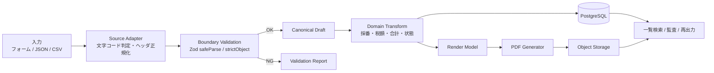
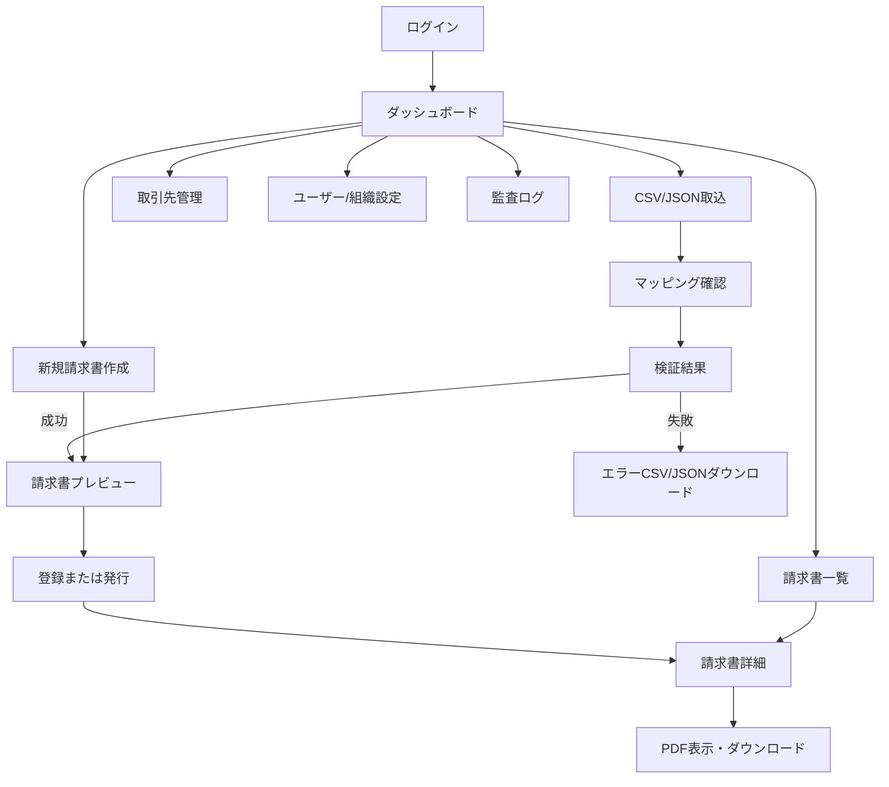
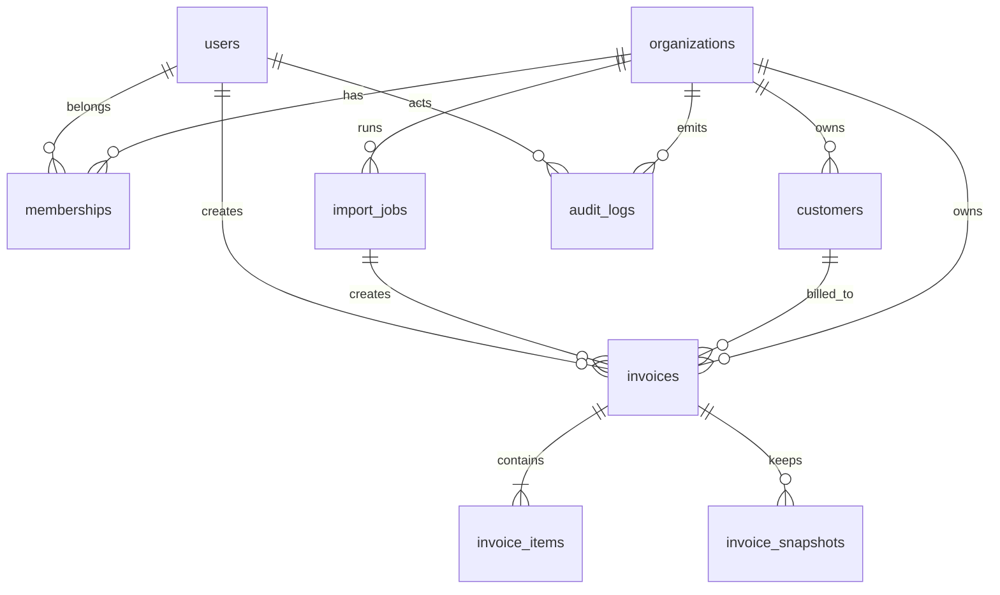

# データ指向請求書プロジェクトのWebアプリ化要件定義レポート

## エグゼクティブサマリ

本件の現行プロトタイプは、TypeScript / Node.js / Zod / pdf-lib の構成で、`input.json` を読み込み、請求書PDFを出力し、日本語フォントにも対応している。処理の中核はすでに「入力 → Zodによる検証 → データ変換 → PDF出力」というデータ指向のパイプラインとして成立している。fileciteturn0file0

一方で、既存の請求書作成ツールは、この中核パイプラインのまわりに、認証・認可、取引先マスタ、一覧検索、一括インポート、送付、承認、会計連携、法対応、監査ログといった運用機能を厚く載せている。Misoca は小規模事業者向けに導入が軽く、freee請求書は帳票発行から債権管理・承認・会計連携まで深く、MakeLeaps は承認・郵送・入金管理・カスタムCSV/API連携まで含む請求管理基盤として位置付けられる。したがって、本プロジェクトをWebアプリ化する場合は、既存SaaSの全面的な再実装ではなく、「入力データの透明な正規化」「検証エラーの可視化」「変換過程の保存」「再現可能なPDF出力」を強みにした、研究向け・カスタム運用向けのアーキテクチャに寄せるのが妥当である。citeturn5view0turn1view2turn19view4turn22view1turn22view2

要件の中心は、既存の JSON 処理を壊さずに、CSV とフォーム入力を同じ canonical schema に集約することにある。JSON は versioned schema として継続サポートし、CSV はヘッダー名で解釈することで列順の自由度を確保しつつ、必須論理項目の不足・重複・型不正を事前に弾く。Zod は `safeParse`、`strictObject`、`coerce`、`transform` を境界検証と正規化に使い、入力段階・検証段階・変換段階・描画段階のスナップショットを保持する。これにより、既存ツールに多い「取り込めたが途中で何が起きたか分からない」状態ではなく、「どの入力が、どの規則で、どの請求書になったか」を追跡可能にする。citeturn13search8turn14view3turn14view4turn14view5turn13search2turn23search0turn23search2

MVP の最適スコープは、認証、組織・ユーザー、取引先マスタ、CSV/JSON取込、検証結果表示、請求書一覧・検索、PDF生成・保存、監査ログ、検索性を備えた PostgreSQL 永続化である。送付、定期請求、テンプレート編集、承認、会計連携、郵送代行、決済・入金連携は P1/P2 に分離すべきである。1名開発を前提とした概算工数は、MVP が 35〜50人日、拡張機能が追加で 30〜55人日である。未指定の点（クラウド事業者、SLA、決済連携先、会計連携先、多言語、多通貨、アクセシビリティ基準、オンプレ要件）は **制約なし** とする。citeturn25view0turn27view1turn29view1turn30view0turn31view1

## 比較対象の調査結果と現在プロジェクトの位置づけ

既存SaaSと比較した場合、現行プロジェクトの強みは「入力データからPDFまでの変換規則が追えること」であり、弱みは「運用機能が未実装であること」である。既存市場で強いのは、帳票作成そのものよりも、その周辺の継続運用機能である。fileciteturn0file0 citeturn22view1turn22view2

| ツール | 機能の要点 | 価格の要点 | 導入難易度 | 本件への示唆 | 根拠 |
|---|---|---|---|---|---|
| Misoca | 見積書・納品書・請求書・領収書、CSVアップロード、会計連携、メール送付、郵送、ステータス管理、インボイス制度・電子帳簿保存法対応。citeturn5view0turn5view2turn4view4turn17view0 | 無料プランあり。無料は請求書月10通まで、有償のエントリー相当はプラン15で年額8,800円+税。citeturn5view0 | **低**。登録が簡単で、作成〜送付が短手順でまとまっているため、小規模運用の導入障壁が低い。citeturn5view0turn2view4turn17view0 | 本件MVPのUI/UXは Misoca 型、すなわち「少項目・短手順・小規模運用最適化」をベンチマークにするのが妥当。 | 公式中心。市場比較の整理として BOXIL/ITトレンドも参照。citeturn22view1turn22view2 |
| freee請求書 | 見積書/納品書/請求書/領収書/発注書、定期・合算請求、一括メール・郵送、帳票共有ポータル、CSV/PDF取込、取引登録、入金消込・仕訳作成、権限管理、承認フロー。citeturn1view2turn5view3turn16view1turn16view2 | 無料プランあり。年払い基準でスタンダード 1,980円/月、アドバンス 10,000円/月、一括発行の送信料金は 4,750円/月〜。表示価格は税抜。citeturn3view2turn3view3 | **中**。CSV/PDF取込は「アップロードするだけ」で軽いが、承認経路・債権管理・権限などは設定項目が多い。citeturn8view4turn16view2 | 「入力→帳票」の先に、債権管理・承認・会計連携をつなぐとどうなるかの到達点。P1/P2 の参照先として有用。 | 公式中心。無料/有料境界は比較記事も補助的に参照。citeturn22view1 |
| MakeLeaps | 10種類の書類作成、電子送付・郵送代行、入金管理、承認、カスタムCSVインポート、API連携、電子帳簿保存法/JIIMA認証対応。citeturn19view4turn19view5turn18view0turn18view1turn21search9 | 無料 0円/ユーザー、個人 1,000円/ユーザー、法人 1,300円/ユーザー、エンタープライズ 33,000円〜/社。別途、取引先数・送付数の従量要素あり。citeturn19view4turn5view4 | **中〜高**。初期設定だけで自社情報・取引先・税設定など複数段階があり、承認・カスタムCSV・APIまで入れると設計負荷が上がる。citeturn8view3turn18view1turn21search11 | 本件の P2。大量配信、承認、外部連携、カスタムCSV、API化の参考実装目標。 | 公式中心。市場比較の文脈補助に BOXIL を参照。citeturn22view1 |

上表から分かるのは、既存製品が競争している主戦場は「請求書作成」そのものではなく、「その周辺機能をいかにまとめて自動化するか」であるという点である。Misoca は小規模向けの軽快さ、freee はバックオフィス統合、MakeLeaps は送付・承認・連携の深さで差別化している。したがって、本研究プロジェクトがWebアプリ化で勝ち筋を持つのは、SaaS横並びの機能比較ではなく、「スキーマ定義と変換規則が明示的」「CSV/JSONの入力差を吸収できる」「中間データを保持できる」という研究・業務カスタマイズ寄りの価値である。citeturn5view0turn1view2turn19view4turn21search9

| 観点 | 既存SaaSの標準水準 | 現在のプロジェクト | Webアプリ要件 |
|---|---|---|---|
| 入力 | CSV/PDF/画面入力、顧客マスタ連携が一般的。citeturn5view0turn16view1turn18view0 | `input.json` を入力としてPDF出力。fileciteturn0file0 | JSON互換維持 + CSV + 画面入力を同一 schema に統合 |
| 検証 | 入力検証はあるが変換の透明性は製品依存 | Zod 検証を明示的に持つ。fileciteturn0file0 | Zod を中核に、ヘッダー検証・行検証・文書検証・業務検証を分離 |
| 変換 | 請求額計算・帳票変換・自動化が豊富。citeturn1view2turn17view0turn19view4 | データ変換は既に中核概念。fileciteturn0file0 | スナップショット永続化で「変換結果の追跡」を強化 |
| PDF | 各製品とも標準実装 | 日本語PDFは実装済み。fileciteturn0file0 | PDFを object storage に保存し、再生成可能にする |
| 認証・DB | 標準実装 | 未実装 | P0 必須 |
| 検索・一覧 | 日付・顧客・金額・状態で検索可能な製品が多い。citeturn22view1turn22view2 | 未実装 | 電子保存と運用を意識し、日付・金額・取引先を中心に設計 |
| 承認・送付・入金 | freee / MakeLeaps では主要機能。citeturn16view2turn19view5turn18view1 | 未実装 | P1/P2 に分離 |
| 法対応 | 適格請求書・電子帳簿保存法対応を前面訴求。citeturn4view4turn5view3turn19view4 | PDF出力段階 | 必須記載事項と保存検索性を取り込む |

結論として、**MVPで目指すべきは Misoca 型の軽さと、現在プロジェクトのデータ指向性の統合**である。**freee 型の債権管理と MakeLeaps 型の承認・送付・外部連携は、拡張計画として追う**のが最も合理的である。citeturn5view0turn1view2turn19view4

## 機能要件と処理要件

日本向けの請求書生成を行う以上、適格請求書として必要な最低限の情報、すなわち発行事業者名と登録番号、取引日、品目内容、税率ごとの合計額と適用税率、税率ごとの消費税額、交付先事業者名は、少なくともデータモデルとPDFテンプレートの両方で表現できなければならない。また、電子取引データの保存実務では、日付・金額・取引先を軸に検索できる設計が強く要求されるため、一覧検索とDB索引もこの軸で設計するのが自然である。citeturn25view0turn27view1

| 優先度 | 機能 | 要件 |
|---|---|---|
| P0 | 認証・組織管理 | メール/パスワードログイン、1組織以上、初期管理者作成、セッション管理 |
| P0 | 取引先マスタ | 取引先コード、名称、メール、住所、支払条件、税設定を管理 |
| P0 | 請求書作成 | 画面入力で請求書下書きを作成、明細追加/削除、税率別計算 |
| P0 | JSON取込 | 既存 `input.json` 相当を崩さず受け入れ、versioned schema で保存 |
| P0 | CSV取込 | ヘッダー検証、列順非依存、行単位エラー、文書グルーピング、重複検知 |
| P0 | 検証レポート | エラー件数、行番号、列名、理由をUIとダウンロードファイルで提示 |
| P0 | 変換スナップショット | 入力・検証済・変換済・描画用の各段階を JSONB で保持 |
| P0 | 一覧・検索 | 発行日、金額、取引先、請求書番号、状態で検索・絞込 |
| P0 | PDF出力 | プレビュー、ダウンロード、保存済PDF再取得、日本語フォント維持 |
| P0 | 監査ログ | import / create / update / issue / download / login を記録 |
| P1 | メール送付 | 送付履歴、再送、送付テンプレート |
| P1 | 繰返し請求 | 月次・隔週などの定期請求テンプレート |
| P1 | レイアウト設定 | ロゴ、印影、差出人情報、帳票テンプレート切替 |
| P1 | 取込プリセット | 組織ごとのCSVヘッダー別名辞書、保存済マッピング |
| P2 | 承認フロー | 作成者→承認者→発行の状態遷移 |
| P2 | 外部連携 | 会計連携、Webhook、REST API 公開、メール/郵送代行 |
| P2 | 入金管理 | 入金ステータス、消込、未収一覧 |

この優先度付けは、既存製品の成熟した運用機能すべてを最初から再実装するのではなく、現行プロジェクトの「入力→検証→変換→PDF」の価値をそのままWebに持ち込むための分割である。P0 は「研究プロトタイプを情報システムにする」最低限であり、P1/P2 は「請求管理SaaSらしさ」に近づける層である。fileciteturn0file0 citeturn1view2turn19view4

現在の処理パイプラインをWebアプリ向けに拡張すると、次のような構成が自然である。Zod を境界で使い、変換過程の各段階を保存する点が重要である。fileciteturn0file0 citeturn13search8turn14view3turn14view4turn14view5

入力互換の設計方針は次のとおりである。**未指定の点は制約なし** としつつ、MVP では日本語・JPY・単一組織運用を既定とする。

| 入力形式 | 単位 | 必須論理項目 | 列順依存 | 互換方針 |
|---|---|---|---|---|
| 既存JSON v1 | 1請求書 | 顧客、明細、単価、数量、発行日など | なし | 現行 `input.json` を legacy adapter で取り込み、canonical schema に変換 |
| 新JSON v2 | 複数請求書可 | `schemaVersion`, `invoices[]` | なし | 公開API向けの正式形式。unknown key は原則 reject |
| CSV | 1行=1明細 | `invoice_group_id` または `invoice_number`、`customer_code` か `customer_name`、`item_name`、`quantity`、`unit_price`、`issue_date` | **なし** | ヘッダー名ベースでマッピングし、同じ `invoice_group_id` を1請求書に束ねる |
| 画面入力 | 1請求書 | UI必須項目と同じ | なし | その場で canonical schema を生成 |

CSV は列順を固定しない。代わりに、ヘッダー名を Unicode 正規化・trim・lowercase 化したうえで、組織既定の alias 辞書と突き合わせる。たとえば `customer_name` / `customerName` / `取引先名` は同じ論理項目に解決し得る。重複して同一論理項目に解決した場合はヘッダーエラー、必須論理項目が1つでも欠けた場合は取込失敗とし、行検証に進めない。ヘッダーによるオブジェクト化や型変換は parser の `transformHeader` / `columns` / `cast` のような仕組みで実装できるが、最終的な真実はサーバー側 Zod 検証とする。citeturn13search2turn23search0turn23search2

Zod の使い分け方針は厳密に分ける。外部入力境界の JSON は `strictObject` で unknown key を拒否し、CSV はまず文字列オブジェクトとして受理したうえで、`coerce.number()` や `preprocess` で数値・日付・空文字を正規化し、その後 `safeParse` で人間向けエラーを返す。変換は Zod の `.transform()` も使えるが、MVP では「検証」と「業務変換」を分け、**検証は schema、金額計算・採番・税額集計は pure function** として切り分けた方がテストしやすい。citeturn13search8turn14view3turn14view4turn14view5

推奨する検証フェーズは、`ファイル検証 → ヘッダー検証 → 行検証 → 文書グループ検証 → 業務検証 → PDF描画検証` の六段階である。ファイル検証では拡張子・MIME・シグネチャ・サイズ上限を見て、ヘッダー検証では alias 解決と必須論理項目確認、行検証では quantity / unitPrice / taxRate / 日付の妥当性、文書グループ検証では同一 invoice にぶら下がる共通項目の不整合、業務検証では採番重複や存在しない顧客コード、PDF描画検証ではテンプレートの必須差込値不足を扱う。アップロードは allowlist・MIME検証・シグネチャ検証・保存場所分離が推奨される。citeturn29view4turn32view2turn32view3

## 主要画面とAPI設計

主要画面は、既存SaaSのように機能別に散らすのではなく、**入力の受け入れ → エラー確認 → 請求書確定 → 検索・再出力** の流れに沿って設計するのが、現行プロジェクトのデータ指向性と整合する。電子保存の観点からも、一覧画面で日付・金額・取引先を軸に検索できることは必須に近い。citeturn27view1

| 画面 | 主目的 | 主な入力/操作 | 優先度 |
|---|---|---|---|
| ログイン | 認証開始 | メール、パスワード、MFA | P0 |
| ダッシュボード | 導線集約 | 新規作成、取込開始、最近の失敗ジョブ、未発行一覧 | P0 |
| 取込ウィザード | CSV/JSON受入 | ファイル選択、source type、ヘッダー解決確認 | P0 |
| 検証結果 | エラー訂正導線 | 行番号、列名、理由、成功件数、エラーファイルDL | P0 |
| 請求書新規/編集 | 手入力作成 | 顧客、明細、税率、期日、備考 | P0 |
| 請求書詳細/プレビュー | 確定前確認 | 中間データ表示、合計、税率別内訳、発行 | P0 |
| 請求書一覧 | 検索と再利用 | 日付、金額、取引先、番号、状態フィルタ | P0 |
| 取引先管理 | マスタ管理 | 取引先登録、支払条件、メール、住所 | P0 |
| 組織/ユーザー設定 | 運用基本設定 | 登録番号、税率既定値、採番規則、権限 | P0 |
| 監査ログ | 追跡 | 誰がいつ何をしたか、import / issue / download 追跡 | P0 |
| 送付履歴 | メール送付管理 | 再送、送付先、テンプレート | P1 |
| 承認キュー | 承認運用 | 申請、承認、差戻し | P2 |

API は UI と同じ「入力・検証・変換・出力」の責務に合わせて分ける。ポイントは、**公開APIの payload でも内部の画面入力でも、最終的に同じ canonical schema を通す**ことである。また、請求書・顧客・import job・audit log の各オブジェクトは、すべて `organization_id` を境に認可される必要がある。OWASP は deny-by-default と every-request authorization check を推奨しており、API では object ID 推測による BOLA を避ける設計が必要である。citeturn30view0turn30view1turn30view3

| Method | Endpoint | 用途 | 優先度 |
|---|---|---|---|
| POST | `/api/session/login` | ログイン | P0 |
| DELETE | `/api/session` | ログアウト | P0 |
| GET | `/api/me` | 現在ユーザーと所属組織取得 | P0 |
| GET | `/api/customers` | 取引先一覧・検索 | P0 |
| POST | `/api/customers` | 取引先作成 | P0 |
| GET | `/api/customers/{id}` | 取引先詳細 | P0 |
| PATCH | `/api/customers/{id}` | 取引先更新 | P0 |
| POST | `/api/imports` | CSV/JSONアップロード、取込ジョブ作成 | P0 |
| GET | `/api/imports/{id}` | 取込結果取得 | P0 |
| GET | `/api/imports/{id}/errors` | エラーファイル取得 | P0 |
| POST | `/api/invoices/preview` | 入力データの検証・計算・プレビュー生成 | P0 |
| POST | `/api/invoices` | 請求書登録 | P0 |
| GET | `/api/invoices` | 請求書一覧・検索 | P0 |
| GET | `/api/invoices/{id}` | 請求書詳細 | P0 |
| PATCH | `/api/invoices/{id}` | 請求書更新（draft まで） | P0 |
| POST | `/api/invoices/{id}/issue` | 発行確定・PDF保存 | P0 |
| GET | `/api/invoices/{id}/pdf` | PDF取得 | P0 |
| GET | `/api/invoices/{id}/snapshots` | 各段階スナップショット参照 | P0 |
| GET | `/api/audit-logs` | 監査ログ一覧 | P0 |
| POST | `/api/invoices/{id}/send-email` | メール送付 | P1 |
| POST | `/api/invoices/{id}/approve` | 承認 | P2 |
| GET | `/api/healthz` | ヘルスチェック | P0 |

API の非機能上の追加要件として、`POST /api/imports`、`POST /api/invoices`、`POST /api/invoices/{id}/issue` は `Idempotency-Key` を受け付けるべきである。CSV の再アップロードやブラウザ再送信で二重請求書が作られるのを防ぐためであり、サーバー側ではファイルの SHA-256 と request key を保存して二重実行を抑止する。これは freee や MakeLeaps が大量・バッチ処理を前提にしていることからも、早期に要求へ入れておく価値がある。citeturn16view1turn18view0

## データモデルとDBスキーマ

本件のDB設計では、通常の「請求書ヘッダ + 明細」だけでは不十分である。現行プロジェクトの強みはデータ変換そのものにあるため、**入力そのもの** と **検証済みの正規化データ** と **計算済みデータ** を別々に保存できるようにする必要がある。請求書ヘッダ・明細は一覧検索と集計のためにリレーショナルに持ち、変換過程は `invoice_snapshots` に JSONB として保持するのが最も整合的である。fileciteturn0file0

| テーブル | 主カラム | 主な制約 / 索引 | 目的 |
|---|---|---|---|
| `organizations` | `id`, `name`, `invoice_registration_no`, `settings_jsonb`, `default_currency`, `created_at` | `invoice_registration_no` nullable、`settings_jsonb` に採番規則・CSV alias・既定税率を保持 | 組織単位の設定、論理テナント境界 |
| `users` | `id`, `email`, `password_hash`, `display_name`, `mfa_enabled`, `mfa_secret_enc`, `last_login_at` | `email` unique | 認証主体 |
| `memberships` | `id`, `organization_id`, `user_id`, `role`, `status`, `created_at` | unique(`organization_id`,`user_id`) | 組織所属とRBAC |
| `customers` | `id`, `organization_id`, `code`, `name`, `billing_email`, `postal_address`, `payment_term_days`, `tax_profile_jsonb` | unique(`organization_id`,`code`), index(`organization_id`,`name`) | 取引先マスタ |
| `import_jobs` | `id`, `organization_id`, `source_type`, `filename`, `sha256`, `header_map_jsonb`, `status`, `total_rows`, `valid_rows`, `error_rows`, `error_report_jsonb`, `created_by`, `created_at`, `completed_at` | unique(`organization_id`,`sha256`) optional、index(`organization_id`,`status`) | CSV/JSON取込ジョブ管理 |
| `invoices` | `id`, `organization_id`, `customer_id`, `import_job_id`, `invoice_number`, `issue_date`, `due_date`, `currency`, `status`, `subtotal`, `tax_total`, `total`, `pdf_storage_key`, `created_by`, `issued_at`, `created_at`, `updated_at` | unique(`organization_id`,`invoice_number`), index(`organization_id`,`issue_date`), index(`organization_id`,`total`), index(`organization_id`,`customer_id`) | 検索・一覧・状態管理の中心 |
| `invoice_items` | `id`, `invoice_id`, `line_no`, `description`, `quantity`, `unit_price`, `amount`, `tax_rate`, `tax_category`, `metadata_jsonb` | unique(`invoice_id`,`line_no`) | 明細の正規化表現 |
| `invoice_snapshots` | `id`, `invoice_id`, `stage`, `revision`, `schema_version`, `payload_jsonb`, `created_at` | unique(`invoice_id`,`stage`,`revision`) | `input / validated / transformed / render` の段階保存 |
| `audit_logs` | `id`, `organization_id`, `actor_user_id`, `entity_type`, `entity_id`, `action`, `ip_address`, `user_agent`, `before_jsonb`, `after_jsonb`, `created_at` | index(`organization_id`,`created_at`), append-only | 監査と障害解析 |

`invoices` に日付・金額・取引先で索引を張るのは、一覧検索UIのためだけでなく、電子取引データの保存で日付・金額・取引先を中心に検索できる設計が求められるからである。また、全ビジネスデータに `organization_id` を持たせるのは、オブジェクトレベル認可を every request で強制するためでもある。citeturn27view1turn30view0turn30view1turn30view3

| テーブル | サンプルレコード |
|---|---|
| `organizations` | `{id:"org_01", name:"西岡研究室", invoice_registration_no:"T1234567890123", default_currency:"JPY", settings_jsonb:{defaultTaxRate:0.10, csvHeaderAliases:{customer_name:["customer_name","customerName","取引先名"]}}}` |
| `users` | `{id:"usr_01", email:"admin@example.jp", password_hash:"$argon2id$...", display_name:"Nishioka", mfa_enabled:false}` |
| `memberships` | `{id:"mem_01", organization_id:"org_01", user_id:"usr_01", role:"admin", status:"active"}` |
| `customers` | `{id:"cus_01", organization_id:"org_01", code:"C001", name:"株式会社A", billing_email:"ap@a.co.jp", payment_term_days:30}` |
| `import_jobs` | `{id:"imp_01", organization_id:"org_01", source_type:"csv", filename:"invoice_202605.csv", sha256:"ab12...", status:"validated", total_rows:12, valid_rows:10, error_rows:2, header_map_jsonb:{'取引先名':'customer_name','単価':'unit_price'}}` |
| `invoices` | `{id:"inv_01", organization_id:"org_01", customer_id:"cus_01", import_job_id:"imp_01", invoice_number:"INV-2026-0001", issue_date:"2026-05-01", due_date:"2026-05-31", status:"issued", subtotal:13000, tax_total:1300, total:14300, pdf_storage_key:"org_01/invoices/inv_01.pdf"}` |
| `invoice_items` | `{id:"itm_01", invoice_id:"inv_01", line_no:1, description:"サービス利用料", quantity:2, unit_price:5000, amount:10000, tax_rate:0.10, tax_category:"standard"}` |
| `invoice_snapshots` | `{id:"snp_01", invoice_id:"inv_01", stage:"transformed", revision:1, schema_version:"v1", payload_jsonb:{customerName:"株式会社A", items:[...], subtotal:13000, tax:1300, total:14300}}` |
| `audit_logs` | `{id:"log_01", organization_id:"org_01", actor_user_id:"usr_01", entity_type:"invoice", entity_id:"inv_01", action:"issue", ip_address:"203.0.113.5", created_at:"2026-05-01T10:15:00+09:00"}` |

重要なのは、**issued された請求書は、後から静かに再計算しない**ことである。税率やテンプレートを変更したい場合は、既存 row を上書きするのではなく、新しい `revision` を持つ snapshot と、新しい PDF を作るべきである。研究としても業務としても、変換の再現可能性と説明可能性が高くなる。fileciteturn0file0

## セキュリティ要件と運用要件

セキュリティについては、Webアプリ化した時点で「入力ファイル」「認証情報」「請求書PDF」「オブジェクトID」を守る必要がある。とくに API では object-level authorization の抜けが最も危険であり、請求書IDを差し替えれば他人の請求書が見える設計は避けなければならない。OWASP は deny-by-default、every-request authorization、MFA、セッションタイムアウト、パスワードの適切なハッシュ化、HTTPS/TLS、セキュアなファイルアップロード、ログ設計を継続的に推奨している。citeturn29view1turn29view0turn30view0turn30view1turn30view3turn31view2turn31view3turn29view4turn29view3

| 領域 | 要件 |
|---|---|
| 認証 | メール/パスワード認証をP0で実装し、パスワード保存は Argon2id を既定とする。管理者は P1 で MFA を必須化、一般ユーザーは任意開始でもよい。ログイン試行はスロットリングし、ブルートフォースを抑止する。citeturn29view0turn29view1 |
| セッション | Cookie は `HttpOnly` / `Secure` / `SameSite=Lax` を基本とし、サーバー側で idle timeout と absolute timeout を強制する。MVPの推奨値は idle 30分、absolute 8時間、権限変更時は session rotation。citeturn31view2turn31view3 |
| 認可 | `organization_id` による論理分離を前提に、**すべての request で** ロール + オブジェクト所有関係を検証する。deny-by-default を原則とし、URL 中のIDや request body 中の `invoiceId` を差し替えても越権できないことをテストする。RBAC を基本としつつ、`作成者本人のみ編集可` などは resource relationship で補う。citeturn30view0turn30view1turn30view2turn30view3 |
| データ保護 | すべて HTTPS で提供し、TLS 1.3 を既定、1.2 を互換用に限定、HSTS を有効化する。DB と object storage は at-rest 暗号化を前提とし、PDF は private bucket に保存し signed URL またはアプリ経由配信とする。citeturn31view3 |
| ファイル保護 | アップロードは `.csv` / `.json` のみに allowlist、MIME とシグネチャを検査、サイズ上限を設定し、保存ファイル名はアプリ生成のランダム名に置換する。公開 webroot に直接置かず、可能なら別ホスト / private storage に分離する。必要に応じて AV scan を追加する。citeturn29view4turn32view2turn32view3 |
| 秘密情報 | DB接続文字列、SMTP鍵、暗号鍵、JWT秘密鍵等はアプリ設定ファイルに直書きしない。secret manager への集中管理と、計画的または自動的な rotation を前提とする。citeturn31view4turn29view5 |
| バックアップ | DB は PITR を前提に日次スナップショット、PDF/エラーレポート格納先は versioning を有効化する。MVP の目標は RPO 24時間以内、RTO 8時間以内。未指定であればこの値を既定とする。 |

運用要件は、単に「動く」ではなく、import 失敗・PDF生成失敗・認証異常・遅延を追えることが重要である。OWASP の Logging Cheat Sheet は、ログに “when, where, who and what” を含めるべきだとし、要件設計の段階で何を記録するか決めるべきだとしている。citeturn31view0turn31view1

| 領域 | 要件 |
|---|---|
| ログ | `login`, `logout`, `failed_login`, `import_created`, `import_failed`, `invoice_created`, `invoice_issued`, `pdf_downloaded`, `settings_changed`, `permission_denied` を最低限記録する。各イベントは **いつ・どこで・誰が・何を** 満たす属性を持つ。機微値（平文パスワード、完全な token、PDF 本文）はログに出さない。citeturn31view0turn31view1 |
| 監視 | HTTP 5xx率、p95 レイテンシ、import 成功率、PDF生成時間、DB接続数、ストレージ使用量、キュー待ち時間（P1以降）を監視対象とする。アラート条件は 5xx率上昇、PDF生成失敗連続、ログイン失敗急増を優先。 |
| バックアップ頻度 | DB は日次フル + 連続WAL、オブジェクトは日次整合性チェック、監査ログは日次アーカイブ。月1回のリストア訓練、四半期ごとの障害復旧演習を推奨。 |
| スケーリング方針 | MVP は単一アプリ + 単一DBでよい。月間請求書件数が増え、PDF生成や一括取込で待ち時間が出る段階で **Web/API/Worker 分離**、Redis queue 追加、object storage CDN 前段化を行う。 |
| ジョブ処理 | PDF生成はP0では同期、P1以降で queue 化。大量CSVは import job として非同期処理し、UIはポーリングまたはSSEで進捗表示。 |
| 保持ポリシー | 法令保持年数は未指定のため **制約なし**。MVP ではアプリ設定で online retention / archive retention を変更可能にする。 |

## 開発見積と想定技術スタック

想定技術スタックは、現行プロトタイプの TypeScript / Node.js / Zod / pdf-lib をできるだけ再利用する構成が最も合理的である。フロントエンドだけを別言語に変えると、入力 schema と変換関数の二重管理が生じるためである。したがって、**TypeScript をUI・API・ドメインで通す**構成を推奨する。fileciteturn0file0 citeturn13search8turn14view4turn14view5

| レイヤ | 推奨スタック例 | 採用理由 |
|---|---|---|
| UI | Next.js + React + TypeScript | 少人数でも画面とAPIの距離が近い |
| API | Next.js Route Handlers もしくは Fastify | MVP は統合が楽、拡張時は分離可能 |
| ドメイン | `packages/domain` に Zod schema / calculators / transformers | データ指向の中核を再利用可能 |
| PDF | `pdf-lib` 継続利用 + 日本語フォント埋込 | 現行資産を活かせる |
| DB | PostgreSQL | 検索性・JSONB・索引設計がしやすい |
| ORM | Prisma | スキーマの明示と移行管理がしやすい |
| オブジェクト保存 | S3互換ストレージ | PDF・エラーレポート保管に適合 |
| 認証 | Cookie session + Argon2id | 管理しやすく、MFA拡張が容易 |
| 非同期処理 | BullMQ + Redis（P1以降） | import / PDF / 送付の分離に有効 |
| テスト | Vitest + Playwright | 計算関数とE2Eの両輪 |
| CI/CD | GitHub Actions + Docker | 学術開発でも扱いやすい |

推奨するモノレポ構成は、`apps/web`、`packages/domain`、`packages/pdf`、`packages/db` の四層である。`packages/domain` に `InvoiceInputSchema`, `InvoiceRowSchema`, `InvoiceDraftSchema`, `InvoiceCalculatedSchema`, `transformInvoice()` を置くことで、フォーム入力・CSV取込・JSON取込・API受信のいずれも同じ規則を通せる。これがこのプロジェクトを既存SaaSと差別化する最重要点である。fileciteturn0file0

工数見積は、**1名開発者、既存の PDF/変換ロジックの再利用率 40〜60%、既製UIコンポーネントを使う**ことを前提にした概算である。未指定の点は **制約なし** としつつ、学術プロジェクトとして無理のない現実的な数値に置いている。

| 作業項目 | MVP 人日 | 拡張 人日 |
|---|---:|---:|
| 現行コードのドメインパッケージ化 | 5〜7 | 1〜2 |
| 認証・セッション・組織/権限 | 5〜7 | 4〜6 |
| 取引先マスタ・設定画面 | 4〜6 | 2〜3 |
| JSON/CSV取込・ヘッダー検証・エラーレポート | 7〜10 | 4〜6 |
| 請求書CRUD・採番・状態管理・検索 | 6〜8 | 2〜4 |
| スナップショット保存・監査ログ | 4〜6 | 2〜4 |
| PDFプレビュー/保存/再取得 | 4〜6 | 2〜3 |
| テスト・CI/CD・デプロイ | 4〜6 | 3〜5 |
| メール送付・テンプレート設定 | 0〜2 | 5〜8 |
| 定期請求・承認・外部連携 | 0 | 12〜20 |
| **合計** | **35〜50** | **30〜55** |

この見積から逆算すると、最も妥当な進め方は、まず **MVP を「検索可能な請求書生成・保存システム」まで作り切る**こと、その後に **送付、承認、会計連携** を追加する二段階構成である。既存製品がすでに強い送付・承認・郵送・入金連携を最初から追うより、まずは「データ指向のパイプラインがWeb上でどこまで透明に運用できるか」を完成させる方が、このプロジェクトの独自性と実装可能性の両方にとって有利である。citeturn1view2turn19view4turn21search9